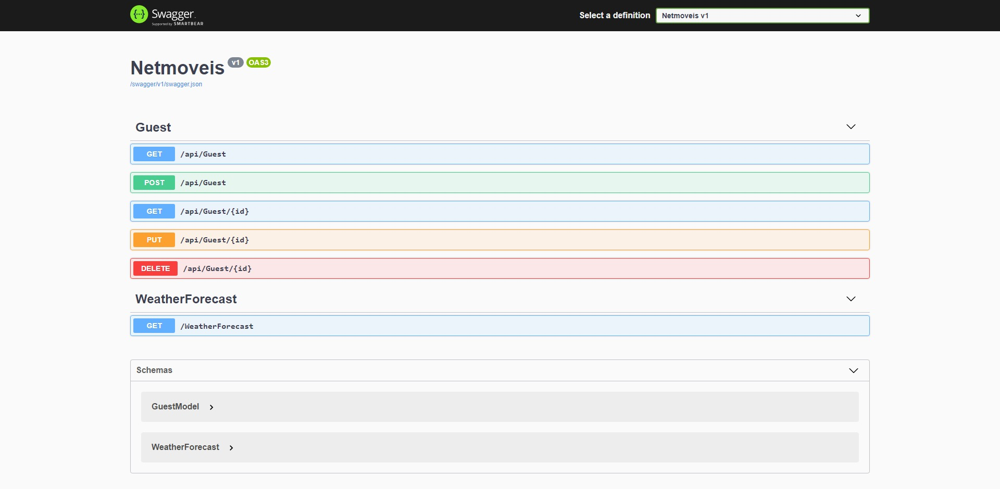

<h1 align="center">
 
  
 
 
NetMoveis
</h1>

Projetos desenvolvido para consulta de API na area imobiliaria

  

  
  

## Tecnologia usada

Usado do modelo de framework, no servidor linux e windows

- ⚛️ **ASP** — ASP classico para servidor windows
-  💹 **C#** — para Gerar e consulta API REST
-  💹 **C#** — Refit REST API Client

## Modelos

1. Hospedado GITHUB 

### Equipe de desenvolvimento

1. David orion (developer)

